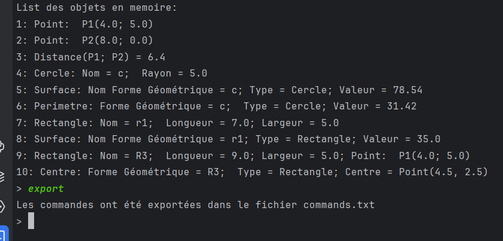

# Geometric Calculations Library

This library is designed for performing various geometric calculations such as distances, areas, perimeters, and more. It supports multiple geometric shapes including points, circles, squares, rectangles, and triangles.

## Getting Started

These instructions will get you a copy of the project up and running on your local machine for development and testing purposes.

### Prerequisites

- Python 3.x
- pip
- virtualenv

### Installation

1. Clone the repository to your local machine:

    ```
    git clone git@github.com:paulmoise/calclu-geom.git
    ```

2. Navigate into the project directory:

    ```
    cd calclu-geom
    ```

3. Create a virtual environment:

    ```
    python3 -m venv venv
    ```

4. Activate the virtual environment:

    - On macOS and Linux:

        ```
        source venv/bin/activate
        ```

    - On Windows:

        ```
        .\venv\Scripts\activate
        ```

5. Install the required dependencies:

    ```
    pip install -r requirements.txt
    ```

## Usage

Run the main script using Python:


Enjoy performing your geometric calculations!

## Examples

Here's a quick example of how to use the library to perform some basic operations.

1. **Creating Points**:
    - `P1 = Point(2;4)` - Creates a point P1 at coordinates (2, 4).
    - `P2 = Point(5;7)` - Creates a point P2 at coordinates (5, 7).

2. **Creating Geometric Shapes**:
    - `C1 = Cercle(P1; 4)` - Creates a circle named C1 with the center at P1 and a radius of 4.
    - `R1 = Rectangle(P1; 10; 5)` - Creates a rectangle with the upper left corner at P1, a width of 10, and a height of 5.
    - `Ca1 = Carre(P2; 6)` - Creates a square named Ca1 with the upper left corner at P2 and a side length of 6.
    - `T1 = Triangle(4;4;8)` - Creates a triangle with vertices at P1, P2, and a third point at coordinates (4, 8).

3. **Performing Calculations**:
    - `d1 = Distance(P1, P2)` - Calculates the distance between points P1 and P2.
    - `sC1 = Surface(C1)` - Calculates the area of the circle C1.
    - `sR1 = Surface(R1)` - Calculates the area of the rectangle R1.
    - `cC1 = Centre(C1)` - Returns the center of the circle C1.
    - `sCa1 = Surface(Ca1)` - Calculates the area of the square Ca1.
    - `sT1 = Surface(T1)` - Calculates the area of the triangle T1.

4. **Exporting Commands**:
    - Type "Export" or "export" to save all entered commands to a file. This can be useful for documenting your work or for reloading the commands in a future session.

To exit the program, type "Quitter".

## Authors

- **Paul Moise** - *Contributor* - [paulmoise](https://github.com/paulmoise)
- **Fatai Idrissou** - *Contributor* - [sifaoufatai](https://github.com/sifaoufatai)
- **Hani Agguini** - *Contributor* - [Hani-Agguini](https://github.com/Hani-Agguini)
- **AbdelouahedKanouni** - *Contributor* - [abdelouahedKanouni](https://github.com/abdelouahedKanouni)


## Images Overview

Below are the images from the image directory of the project that detail the use of the program:

### Welcome Message and Instruction Overview

- The final image displays the welcome message of the program and gives an overview of the instructions for creating points, geometrical shapes, and how to perform operations like calculating distance, surface, and center of shapes.


### Adding a Rectangle with a Point Reference

- This image shows the process of creating a rectangle named `R3` with a point `P1` as a reference and dimensions of length 9 and width 5.

### Calculating the Center of a Rectangle

- Here, we see the calculation of the center `C1` of the previously created rectangle `R3`. The center is determined to be at the point (4.5, 2.5).

### Exporting Commands

- This image illustrates the command `export` which is used to save all the entered commands into a file named `commands.txt`.

### The Export File in the Project Directory

- The screenshot shows the project directory with the `commands.txt` file, indicating that the export was successful.

### Code File in the Project Directory

- This image presents the code file opened in an editor with the list of commands entered so far, ready for execution or editing.

### Importing Commands

- In this image, the user is importing commands from the `instruction.txt` file, demonstrating how to load previous commands into a session.


## License

This project is licensed under the MIT License - see the [LICENSE.md](LICENSE.md) file for details

